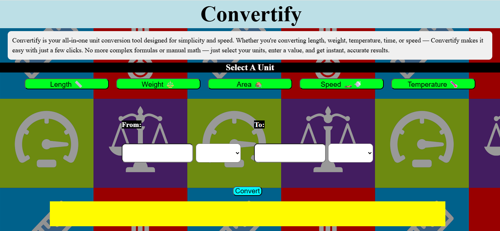
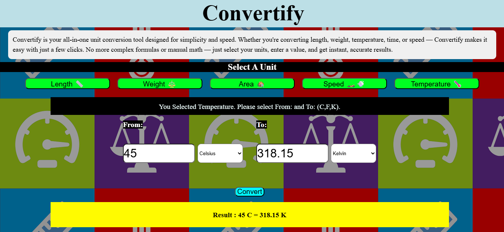

# 🌐 Convertify

**Convertify** is a lightweight and interactive unit converter web app that allows users to quickly and accurately convert between common measurement units. Whether you're working with distances, weights, temperatures, areas, or speeds — Convertify has got you covered.

## 🚀 Features

- 📏 **Length Conversion** (KM, M, CM)
- ⚖️ **Weight Conversion** (KG, G, MG)
- 🌡️ **Temperature Conversion** (°C, °F, K)
- 🏡 **Area Conversion** (SQM, SQFT, ACRE)
- 🏎️ **Speed Conversion** (KM/H, M/S, MPH)

## 📸 Preview

## 💻 Built With

- **HTML** – Structure
- **CSS** – Styling (Responsive layout, mobile-friendly)
- **JavaScript** – Dynamic interactivity and logic for unit conversions

✨ Future Improvements
Add support for more units (volume, time, currency, etc.)

👨‍💻 Author
Made with ❤️ by [Parth Kamath](https://github.com/ParthK604)
